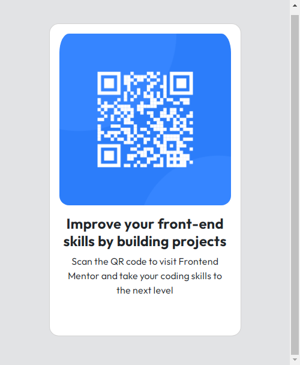
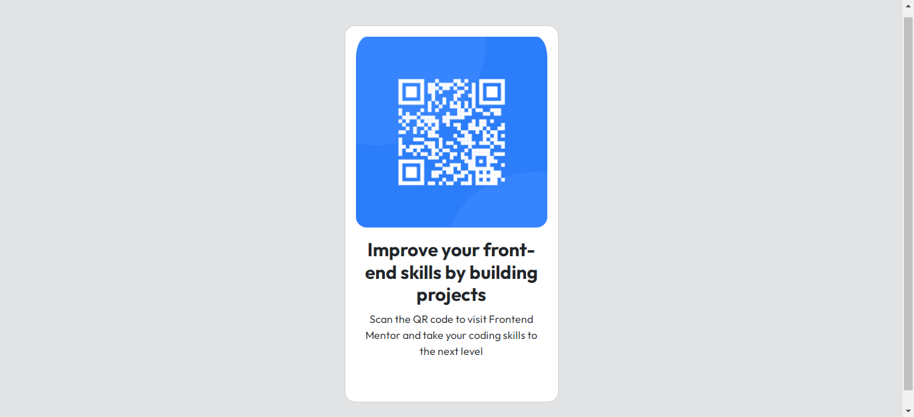

# Frontend Mentor - QR code component solution

This is a solution to the [QR code component challenge on Frontend Mentor](https://www.frontendmentor.io/challenges/qr-code-component-iux_sIO_H).

## Table of contents

- [Overview](#overview)
  - [Screenshot](#screenshot)
  - [Links](#links)
- [My process](#my-process)
  - [Built with](#built-with)
  - [What I learned](#what-i-learned)
  - [Continued development](#continued-development)

## Overview

### Screenshot

### Links

- Solution URL: (https://www.frontendmentor.io/solutions/qr-code-challenge-solution-BFjq-EYPnJ)
- Live Site URL: (https://desthubtech.github.io/QRcode/)

## My process

I created my project folder: QRCODE
I then added my img folder with relevant content
I created my html file
I created my style.css file and linked it in my html code
I used Boostrap link to import needed css styles and classes
I imported font from google fonts
Then I went on to build

### Built with

- html
- Bootstrap 5

### What I learned

i learnt how to use Bootstrap to make my coding fast and easy

### Continued development

I look forward to continue learning and master Bootstrap
